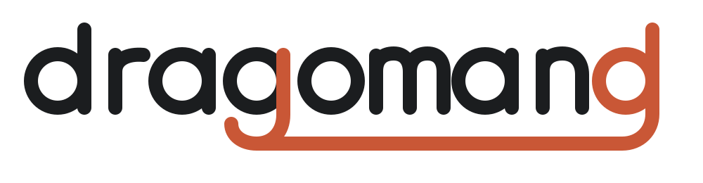

# Dragomand

<https://dragomand.l10n-bg.dev> &middot;
upstream: <https://github.com/VuteTech/dragomand>

A per-user Linux daemon that gives desktop applications fully offline
machine translation over D-Bus. It runs Mozilla's Bergamot/Marian
translation models (the ones behind Firefox Translations) locally and
manages which models are installed and which stay loaded in memory.

```sh
$ dragomanctl translate -f bg -t en "Добро утро. Как си днес?"
Good morning. How are you today?
```

The first call downloads the model from Mozilla (verified by sha256) and
starts the daemon via D-Bus activation; everything afterwards is fully
offline, and the daemon exits again when idle.

## Why

The existing Linux options are either standalone apps (LocalTranslate,
translateLocally, Argos Translate GUI) or tied to one host (Firefox, the
ONLYOFFICE plugin). None of them is a shared service that editors,
browsers, clipboard tools, KRunner, shells and accessibility software can
all call, and none tracks Mozilla's current model releases.

## What exists

- `dragomand` — the daemon: session bus name
  `dev.l10n_bg.dragomand.Translator1`, portal-style request objects,
  per-client limits, interactive-before-batch scheduling, pivoting through
  English, LRU model eviction with a memory budget, memory-pressure
  handling, idle exit. Contract in
  `data/dbus/dev.l10n_bg.dragomand.Translator1.xml`.
- `dragomanctl` — the CLI: `translate`, `pairs`, `install`, `remove`,
  `update`, `status`, plus bus-free `store` subcommands for packagers.
  `--json` everywhere, shell completions, man page.
- The translation engine is Mozilla's own `inference/` tree
  (bergamot-translator + marian-fork), vendored at the exact commit the
  shipped Firefox engine was built from and compiled natively — the same
  models Firefox installs, from the same Remote Settings service. No MKL:
  the generic CBLAS interface, so distributions supply their usual BLAS.
- Every language pair Mozilla publishes (106 currently); Bulgarian ↔
  English is the reference pair.

Deeper docs live in `docs/` (model compatibility rule, benchmarks,
packager notes); the website and user documentation are in `doc/`.

## Building

```sh
cmake -S engine -B engine/build -G Ninja && cmake --build engine/build
DRAGOMAN_ENGINE_LIB_DIR=$PWD/engine/build cargo build --release --workspace
```

`cargo build --no-default-features` skips the C++ engine entirely (fake
backend, used by most tests). See `docs/packaging.md` for distribution
builds and `packaging/obs/PKGBUILD` for a complete example.

## License

GPL-3.0-or-later. The vendored engine keeps its own licenses
(MPL-2.0/MIT/Apache-2.0/BSD, collected in `engine/vendor/LICENSES/`);
`deny.toml` enforces the dependency allowlist. Models are downloaded data,
not part of the GPL work.

The logo lettering is drawn as paths, inspired by the Comfortaa SemiBold
typeface (Johan Aakerlund, SIL OFL 1.1) without embedding the font; see
`artwork/README.md`.
