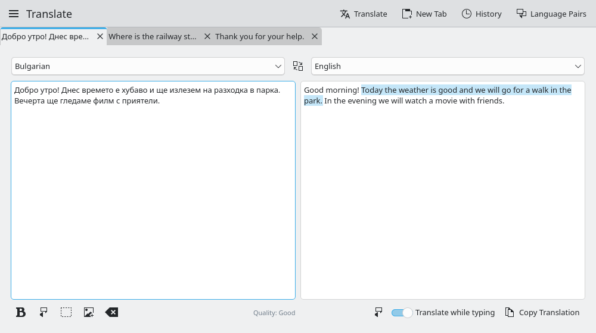
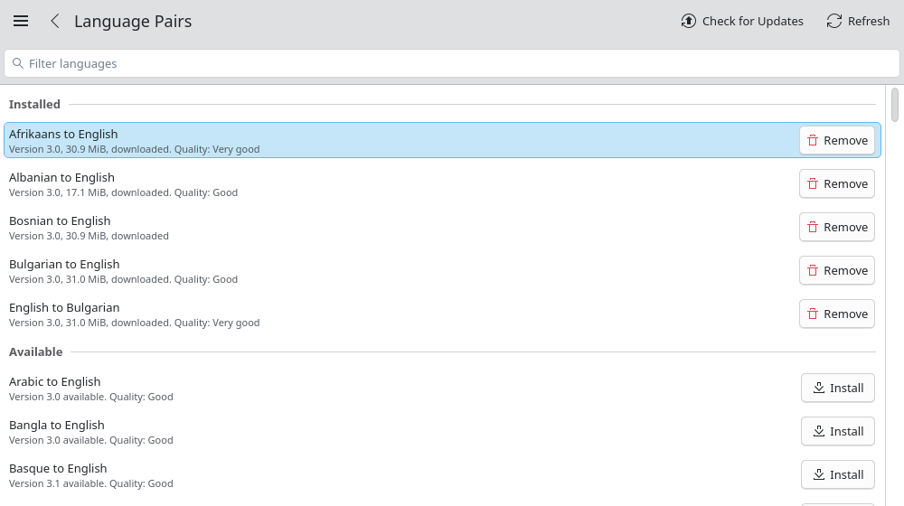

# Кракоман

{ .page-icon }

Кракоман (Krakoman) е графичен преводач за работната среда KDE, който
работи изцяло без интернет. Въведете или поставете текст и преводът
следва, докато пишете; превеждат се също документи, субтитри и текст от
екрана. Сам той не превежда: всичко минава през демона Dragomand, така
че текстът не напуска компютъра, а моделите се споделят с всички
останали интеграции.

Разработва се като отделен проект,
[Krakoman](https://github.com/VuteTech/krakoman), и се пакетира в
същото хранилище като Dragomand.

{ .screenshot }

## Изисквания {#requirements}

**Dragomand 0.2 или по-нова версия.** Кракоман се обръща към демона
през D-Bus, а демонът се стартира при нужда. Пакетът зависи от
`dragomand`, така че инсталирането на Кракоман инсталира и демона.

**KDE Frameworks 6.** Кракоман е приложение на Kirigami за Qt 6.8 и KDE
Frameworks 6.13 или по-нова версия. Работи във всяка работна среда, но
иконата в системния панел и глобалната клавишна комбинация работят най-добре
в KDE Plasma.

## Инсталиране {#install}

Първо добавете хранилището на Dragomand, както е описано на страницата
[Инсталиране](install.md), след това инсталирайте пакета `krakoman`:

=== "openSUSE"

    ```sh
    sudo zypper install krakoman
    ```

=== "Fedora"

    ```sh
    sudo dnf install krakoman
    ```

=== "Debian и Ubuntu"

    ```sh
    sudo apt install krakoman
    ```

=== "Arch Linux"

    ```sh
    sudo pacman -S krakoman
    ```

Пакетите се изграждат за x86-64 навсякъде и за 64-битов ARM там, където
хранилището има ARM версии. След това Кракоман се появява в менюто с
приложения като **Кракоман**, офлайн преводач.

## Превод на текст {#translating-text}

Изберете двата езика горе, след това въведете или поставете текста.
Преводът следва след кратка пауза; когато **Превод при писане** е
изключено, натиснете **Ctrl+Return**.

- **Раздели.** Няколко превода остават отворени в раздели (**Ctrl+T**
  отваря нов, **Ctrl+W** го затваря), всеки със свои езици. Докато
  пишете, превежда само видимият раздел, а разделите се връщат при
  следващото стартиране.
- **Посоката се разпознава.** Текст на целевия език разменя двата езика;
  текст на трети език предлага превод от него.
- **Форматиране.** Поставените заглавия, получер и курсив, връзки,
  списъци и таблици могат да се запазят, и преводът ги запазва също.
- **Съответни изречения.** В обикновен текст изречението под курсора се
  осветява в превода.
- **Четене на глас и правопис.** Двата текста могат да се прочетат на
  глас, а правописът на изходния текст се проверява на неговия език,
  когато са инсталирани гласов синтезатор и речник за езика.
- **Превод през посредник и качество.** Когато няма пряк модел, демонът
  превежда през английски и страницата го казва. Всяка езикова двойка
  показва оценката за качество на своя модел.

Езикова двойка, която още не е инсталирана, никога не се изтегля,
докато пишете: страницата съобщава за нея и предлага **Инсталиране и
превод**. След изтеглянето двойката работи без интернет.

Клавишни комбинации: **Ctrl+Return** превежда, **Ctrl+L** отива на
текста, **Ctrl+Shift+S** разменя езиците, **Ctrl+Shift+C** копира
превода.

## Текст от екрана и от изображения {#text-on-screen-and-in-images}

**Четене на текст от екрана** ви оставя да изберете част от екрана и
превежда текста в нея; **Четене на текст от изображение** прави същото
за файл с изображение. Текстът се разпознава без интернет с Tesseract.
В KDE Plasma частта от екрана се избира със Spectacle, другаде чрез
прозореца за снимки на екрана на работната среда.

Tesseract има нужда от данните за езика, който четете. Пакетът препоръчва
английските; другите се инсталират по същия начин:

| Дистрибуция | Пакет за български (`bul`) |
|---|---|
| Fedora | `tesseract-langpack-bul` |
| Debian и Ubuntu | `tesseract-ocr-bul` |
| Arch Linux | `tesseract-data-bul` |

!!! note "openSUSE"
    Пакетите за openSUSE са изградени без разпознаване на текст, защото
    текущата библиотека Tesseract в openSUSE се срива всеки път, когато
    завърши четенето, затова двете команди там не се показват. Те ще се
    върнат с по-нов пакет, когато Tesseract бъде поправен.

## Документи и субтитри {#documents-and-subtitles}

**Превод на документ…** в главното меню превежда файлове с обикновен
текст, Markdown, SubRip (`.srt`) и WebVTT (`.vtt`). Превежда се само
текстът: код, връзки, номерация, времена и имена на говорители остават
каквито са. **Запазване като…** предлага името на оригинала с добавен
целеви език, например `talk.en.srt`. Документът стига до демона като
файл, а не през D-Bus, така че и големите файлове не са проблем.

Документи могат да се изпращат към Кракоман и от контекстното меню на
Dolphin (**Превод с Кракоман**), от менюто за споделяне в приложенията
на KDE или от терминал.

## История и разговорник {#history-and-phrasebook}

Преводите се пазят в история на този компютър, която може да се изключи
от настройките. Отбелязаните преводи образуват разговорник и оцеляват
след **Изчистване на историята**.

## В работната среда {#on-the-desktop}

- **Системен панел.** Когато **Работа в системния панел** е включено,
  затварянето на прозореца оставя Кракоман в системния панел.
- **Превод на избрания текст.** **Meta+Alt+T** във всяко приложение
  превежда избрания текст в Кракоман. Комбинацията може да се смени в
  Системни настройки, в раздела „Клавишни комбинации“.
- **Превод на копирания текст.** По желание всичко, което копирате, се
  превежда.

## Езикови двойки и състояние {#language-pairs-and-status}

**Езикови двойки** в главното меню изброява всички двойки, които Mozilla
публикува, инсталирани или не, с версия, размер, произход и качество.
Оттам двойките се инсталират, обновяват и премахват, а доставчикът се
проверява за обновления.

{ .screenshot }

**Състояние на услугата** показва версията на демона, използваната
памет, чакащите заявки и заредените двойки. Данните се извличат, когато
отворите страницата, никога във фонов режим, за да може неизползваният
демон да приключи работа.

## Команден ред {#command-line}

Командният ред попълва прозореца, а второ стартиране предава аргументите
си на вече отворения прозорец:

```sh
krakoman --source bg --target en "Добро утро"
krakoman --document talk.srt
```

## Изграждане от изходен код {#build-from-source}

Нужни са CMake 3.24, extra-cmake-modules, Qt 6.8, KDE Frameworks 6.13 и
[libdragoman-qt](libdragoman-qt.md). Tesseract и рамката Purpose на KDE
не са задължителни. В копие на хранилището `krakoman`:

```sh
cmake -S . -B build -G Ninja -DBUILD_TESTING=ON
cmake --build build
ctest --test-dir build
sudo cmake --install build
```

Хранилището съдържа и манифест за Flatpak. Изолираната версия използва
инсталирания в системата Dragomand и няма разпознаване на текст и четене
на глас, защото средата на KDE не съдържа нито Tesseract, нито гласов
синтезатор.

## Решаване на проблеми {#troubleshooting}

**„Няма връзка с услугата за превод“** или **„Услугата за превод не
отговаря.“**: проверете демона от терминал:

```sh
dragomanctl status
dragomanctl pairs
```

**Липсва Четене на текст от екрана.** Пакетът е изграден без Tesseract;
в openSUSE това е умишлено, вижте
[Текст от екрана и от изображения](#text-on-screen-and-in-images).

**Разпознаването на текст не намира нищо или греши буквите.** Инсталирайте
данните на Tesseract за езика на текста и изберете част от екрана само с
текста.

**Meta+Alt+T не прави нищо.** Друго приложение може да използва същата
комбинация; сменете я в Системни настройки, в раздела „Клавишни
комбинации“. Кракоман трябва да работи, например в системния панел.

За проблеми със самия демон вижте
[Решаване на проблеми](troubleshooting.md).
